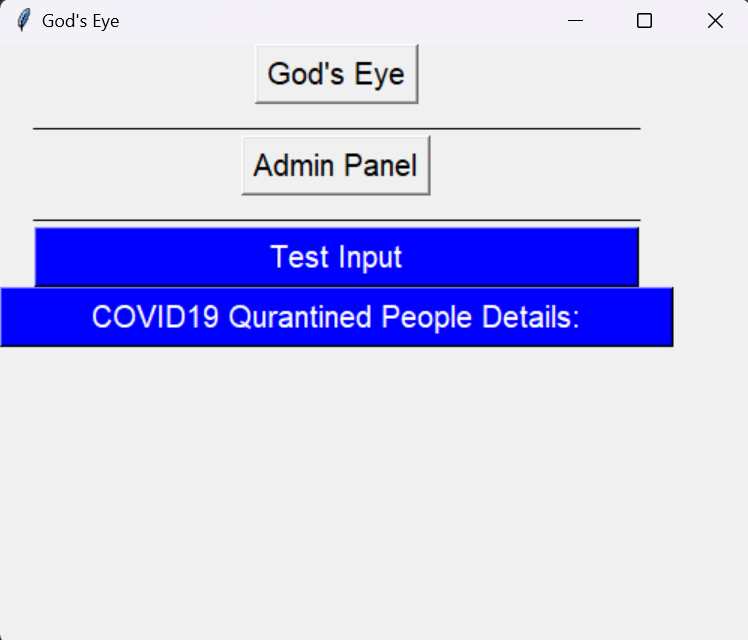
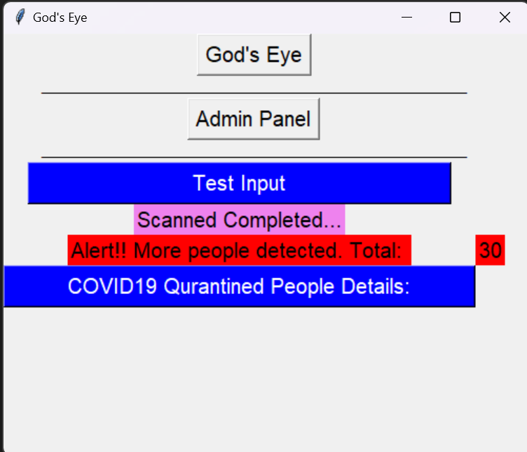
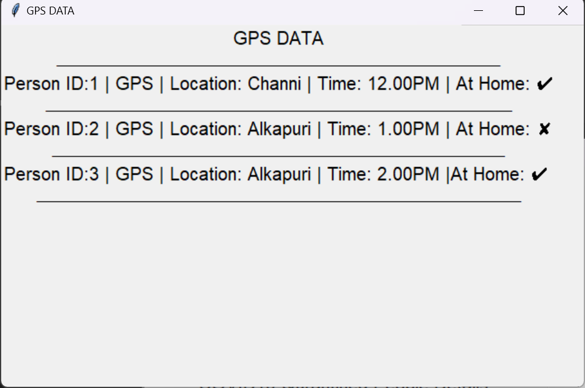

[](https://img.shields.io/badge/language-python3.8-blue
) 
[](https://img.shields.io/badge/coverage-86%25-orange
)

# God's Eye
Welcome to the God's Eye project! In response to the COVID-19 pandemic, this tool has been developed to detect the number of people in an image. During these challenging times, it is crucial to adhere to social distancing guidelines, and this project aims to contribute by identifying and monitoring the presence of people in groups.

## Features
- **People Detection:** God's Eye uses computer vision techniques to analyze images and determine the count of individuals present.

- **Tkinter UI:** The project includes a user-friendly Tkinter-based graphical user interface (GUI) for ease of interaction.

## Screenshots
1. 

2. 

3. 

4. 

5. 
.jpg)
## How it Works
God's Eye leverages computer vision techniques to analyze images and determine the count of individuals present. By identifying and counting people, it provides valuable insights into the level of compliance with social distancing measures.

## Installation
### 1. Clone the repository:

```bash
git clone https://github.com/hmgtech/God-s-Eye.git
cd God-s-Eye
```
### 2. Install the required dependencies:

```bash
pip install -r requirements.txt
```

### 3. Run God's Eye:

```bash
python test_tk.py
```
## Usage
1. Input an image containing people.
2. Run God's Eye.
3. Receive the count of individuals detected in the image.

## License
This project is licensed under the terms of the MIT license. Stay safe!